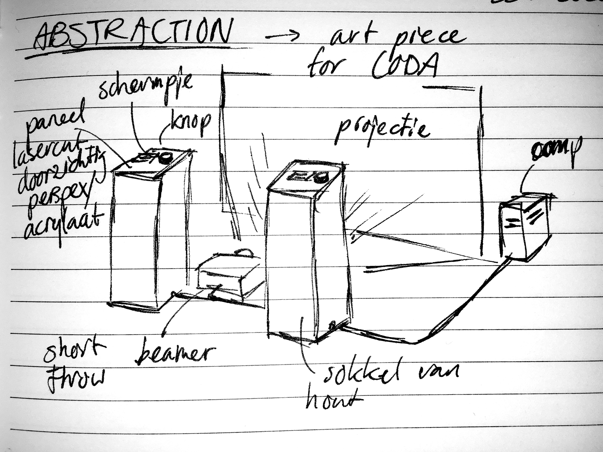

---
headerincludes:
	- \usepackage{fontspec}
	- \setmainfont{Arial}
	- \usepackage[english]{babel}
fontsize: 11pt
geometry: margin=2.2cm
pagestyle: plain
papersize: a4
# fontfamily: Arial
mainfont: Arial
monofont: Inconsolata
# fontfamily: inconsolata
# biblio-style: ieee
documentclass: article
linestretch: 1.1
# hyphenrules: nohyphenation
...

# Abstraction

door Timo Hoogland, 2022

## Titel

`abstraction` *(niet definitief, work-in-progress)*

## Omschrijving

Deze interactieve audiovisuele installatie geeft de bezoeker inzicht in de werkwijze van digitale systemen. Binnen een programma bestaan veel lagen (*abstracties*) met verschillende functies die samenwerken. Elke functie kan op zichzelf staan en heeft een input, een transformatie en een output, maar door functies te koppelen zorg je ervoor dat er een output ontstaat die complexer is dan de losse functies opzich aankunnen. In de installatie kunnen twee bezoekers een eigen functie kiezen door middel van een klein bedieningspaneel en de input van de functie veranderen. De output van deze losse functies is zowel zichtbaar via een projectie als ook hoorbaar, waarbij het beeld en geluid aan elkaar gekoppeld zijn en een gezamenlijke functie krijgen. Zodra de bezoekers verbinding zoeken door elkaar aan te raken zullen zij een nieuwe abstractie vormen en de functies samengevoegd worden tot een groter geheel.

## Uitleg van de titel

`Abstraction` is een proces van het weglaten van niet-essentiële informatie en vervolgens te generaliseren om daarmee de fundamentele structuren zichtbaar te maken. Abstractie komt van het Latijnse abstráhere (weglaten). Een abstractie verbindt alle onderliggende processen in een groep. De term abstractie vindt haar weg door wetenschap, wiskunde en ook als kunststroming en is een belangrijk onderdeel dat onze intelligentie kenmerkt en ons in staat stelt patronen te zien en verbindingen te leggen.

## Biografie

Timo Hoogland is een digitale kunstenaar, live coder, muziek technoloog en docent uit Apeldoorn. Hij maakt live experimentele elektronische muziek met computer code en ontwikkeld daarnaast generatieve audiovisuele composities en installaties. In zijn werk haalt Timo inspiratie uit wiskundige concepten, geometrie, natuurlijke fenomenen en chaotische of deterministische systemen en experimenteert met deze algoritmes om beeld en klank te creëeren in het digitale domein.

### Links

- https://timohoogland.com
- https://instagram.com/tmhglnd
- https://timohoogland.bandcamp.com
- https://github.com/tmhglnd

\newpage

## Technische rider

Een eerste schatting van de benodigdheden. Al het benodigde materiaal zal aangeschaft, gehuurd of geleend moeten worden. In overleg kunnen uiteraard sommige materialen aangepast worden op basis van budget.

- 1 short-throw beamers, 1080p HD, 5000 ANSI-Lumen 

	- voor een sterke projectie is een hoge ANSI waarde belangrijk.

- Stand-alone computer

	- Windows 10, met GTX980 (of betere) grafische kaart
	- OF Mac Mini M1 (compacter voor een installatie)

Ik heb wel ook interesse om te kijken of de installatie zelfs op een RaspberryPi kan draaien, maar daar heb ik nog geen experimenten mee kunnen doen. Maar aangezien de installatie ook lang moet staan is een windows of mac misschien wat betrouwbaarder.

- 2 Studio kwaliteit speakers en geluidskaart, eventueel met aparte koptelefoons

- 2 Sokkels waarop de bediening voor de installatie geplaatst kunnen worden

- Bedieningspaneeltje voor de bezoekers bestaande uit een klein LED/TFT scherm voor tekst en een paar draaiknoppen om getallen mee aan te passen. Dit stuurt via een Arduino/Teensy controller-informatie naar de computer. Lasercutting van plexiglas/hout om scherm en knoppen in te monteren en te verwerken in de sokkel.

- Stekkerdozen, haspels en verlengkabels voor alle apparatuur
	
	- Afhankelijk van de afstanden die overbrugd moeten worden

## Materiaalkosten

| Omschrijving | Bedrag |
| - | - |
| Teensy/Arduino (2x) | 60 |
| OLED Schermpje (2x) | 100 |
| Knoppen | 20 |
| Bekabeling | 20 |
| Sokkels bouwen (2x) | 100 |
| Totaal | 300 |