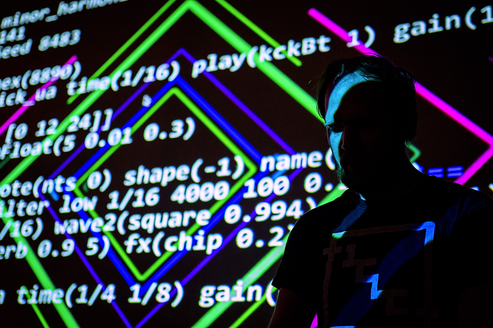

---
headerincludes:
	- \usepackage{fontspec}
	- \setmainfont{Arial}
	- \usepackage[english]{babel}
	- \usepackage{fvextra}
	- \DefineVerbatimEnvironment{Highlighting}{Verbatim}{breaklines,breakanywhere,commandchars=\\\{\}}
fontsize: 11pt
geometry: margin=1.5cm
pagestyle: empty
papersize: a5
# fontfamily: Arial
mainfont: Arial
monofont: Ubuntu Mono
# monofont: Inconsolata
# fontfamily: Ubuntu
# biblio-style: ieee
documentclass: article
linestretch: 1
# hyphenrules: nohyphenation
# title: Abstraction
# author: Timo Hoogland
...

\large

# `.abstraction()`

door Timo Hoogland, 2023

\newpage

## Introductie

*Abstraction* is een interactieve live coding installatie die je mee neemt in de wereld van creative coding, open source systemen en free culture. Een systeem bestaat uit veel lagen (*abstracties*) met verschillende functies die samenwerken. Elke functie kan op zichzelf staan en heeft een input, een transformatie en een output, maar door functies te combineren is het mogelijk een output te genereren die complexer is dan de losse onderdelen. Door gebruik te maken van open source *libraries* en *frameworks* kan je als coder eigen systemen ontwikkelen.

In de installatie kunnen twee bezoekers samen beeld en geluid *coden*. Door aan de knoppen te draaien veranderd de code op het scherm. Als de gebruikers samenwerken kunnen ze het geheel complexer maken. 

Het hele systeem van deze installatie is open. Zo draait de installatie op een Raspberry Pi en wordt de electronica aangestuurd met een Arduino, beiden micro-computers ontwikkeld met het doel technologie toegankelijk te maken en te democratiseren. De software is geschreven met Javascript en HTML (de talen van het internet) tot een web applicatie die in Linux OS draait. De installatie is gemaakt met behulp van verschillende frameworks zoals NodeJS, p5.js (een JavaScript creative coding library ontwikkeld door Lauren Lee McCarthy) en Hydra (een live coding visuele synthesizer ontwikkeld door Olivia Jack).

## Uitleg van de titel

*Abstraction* is een proces van het weglaten van niet-essentiële informatie en vervolgens te generaliseren om daarmee de fundamentele structuren zichtbaar te maken. Abstractie komt van het Latijnse abstráhere (weglaten). Een abstractie verbindt alle onderliggende processen in een groep. De term abstractie vindt haar weg door wetenschap, wiskunde en ook als kunststroming en is een belangrijk onderdeel dat onze intelligentie kenmerkt en ons in staat stelt patronen te zien en verbindingen te leggen.

## Over de kunstenaar

Timo Hoogland is een digitale kunstenaar, live coder, muziek technoloog en docent uit Apeldoorn. Hij maakt live experimentele elektronische muziek met computer code en ontwikkeld daarnaast generatieve audiovisuele composities en installaties. In zijn werk haalt Timo inspiratie uit wiskundige concepten, geometrie, natuurlijke fenomenen en chaotische of deterministische systemen en experimenteert met deze algoritmes om beeld en klanken te creëeren in het digitale domein.

- [timohoogland.com](http://www.timohoogland.com)

- [@tmhglnd op instagram](http://instagram.com/tmhglnd)

- [@tmhglnd op youtube](http://youtube.com/tmhglnd)

<!--  -->

<!-- \newpage -->

## Licentie

De software in dit boekje is gelicenseerd onder de **GNU GPLv3 licentie**: 

- [https://choosealicense.com/licenses/gpl-3.0/](https://choosealicense.com/licenses/gpl-3.0/)

De creatieve output van dit werk is gelicenseerd onder de **CC BY-SA 4.0 licentie** (Creative Commons Attribution-ShareAlike 4.0 International): 

- [https://creativecommons.org/licenses/by-sa/4.0/legalcode](https://creativecommons.org/licenses/by-sa/4.0/legalcode)

**Dit is een Free Culture Licentie!**

Je bent vrij om:

Delen — te kopiëren, te verspreiden en door te geven via elk medium of bestandsformaat.

Bewerken — te remixen, te veranderen en afgeleide werken te maken
voor alle doeleinden, inclusief commerciële doeleinden.

Deze licentie is goedgekeurd voor Free Cultural Works.

Onder de volgende voorwaarden:

Naamsvermelding — De gebruiker dient de maker van het werk te vermelden, een link naar de licentie te plaatsen en aan te geven of het werk veranderd is. Je mag dat op redelijke wijze doen, maar niet zodanig dat de indruk gewekt wordt dat de licentiegever instemt met je werk of je gebruik van het werk.

GelijkDelen — Als je het werk hebt geremixt, veranderd, of op het werk hebt voortgebouwd, moet je het veranderde materiaal verspreiden onder dezelfde licentie als het originele werk.

<!-- Deze software is gedeeld in de hoop dat het nuttig kan zijn, maar ZONDER ENIGE GARANTIE; zelfs zonder de impliciete garantie van VERKOOPBAARHEID of GESCHIKTHEID VOOR EEN BEPAALD DOEL. Zie de GNU General Public License voor meer details. -->

\normalsize

\newpage

# Source Code

## Arduino controller

filename: `controller.ino`

```c
/*
  Written by Timo Hoogland

  The installation uses a small controller to control Audio 
  and Visuals
  Uses LCD Display, 2 Potentiometers, a Button (NO) and LED

  Displays selected function on screen
  Displays the potmeter value as floatingpoint value

  Using OSC example code from Adrien Freed - Library CNMAT/OSC
  Using LCD example code from Bill Perry - Library hd44780
*/

// include the libraries needed for Ethernet, OSC messaging
#include <Ethernet.h>
#include <EthernetUdp.h>
#include <SPI.h>
#include <OSCMessage.h>

// declare EthernetUDP object
EthernetUDP udp;

// include the libraries needed for LCD Display with backpack
#include <Wire.h>
#include <hd44780.h>
#include <hd44780ioClass/hd44780_I2Cexp.h>

// declare LCD object
hd44780_I2Cexp lcd;

// the device's ID
char device[] = "/control1";

// Ethernet shield1 MAC Address A8:61:0A:AE:A8:6D
byte mac[] = { 0xA8, 0x61, 0x0A, 0xAE, 0xA8, 0x6D };

// Ethernet shield2 MAC Address A8:61:0A:AE:95:10
// byte mac[] = { 0xA8, 0x61, 0x0A, 0xAE, 0x95, 0x10 };

// the Arduinos IP address
IPAddress ip(128, 32, 122, 252);
// destination IP is all addresses in network
IPAddress outIp(255, 255, 255, 255);
// IPAddress outIp(169, 254, 50, 206);
// receiving port
const unsigned int outPort = 9999;

// history of values for filter
int _f = 0;
int _v = 0;
int _s = HIGH;
int thresh = 1;
bool changed = true;

// function names for display
char *functionNames[] = {"squiggle", "mosaic", 
						"smear", "glass", "paint"};

// The startup program running once
// 
void setup() {
  // input for button
  pinMode(2, INPUT_PULLUP);

  // Start ethernet connection for mac address and ip
  Ethernet.begin(mac, ip);
  // Open receiving port number
  udp.begin(8888);

  // Initialize LCD Display with columns and rows
  int status = lcd.begin(20, 4);
  // Status is non-zero if unsuccesful
  if (status){
    // Blink error code using onboard LED if possible
    hd44780::fatalError(status);
  }

  // Otherwise initialization succesful, load start screen text
  startScreen();
}

// The main program running continuously in a loop
// 
void loop() {
  // read knobs from analog inputs and emit osc message
  int f = analogRead(A0);
  int v = analogRead(A1);
  int s = digitalRead(2);
  
  // threshold to change value to remove noise from potentiometer
  // only send message when value changed
  if (abs(f - _f) > thresh){
    oscSend("/control1/function", f);
    _f = f;
    changed = true;
  }
  if (abs(v - _v) > thresh){
    oscSend("/control1/value", v);
    _v = v;
    changed = true;
  }
  if (abs(s - _s) > 0){
    oscSend("/control1/switch", s);
    _s = s;
    changed = true;
  }

  // print all the text on the display and change the LED color
  // but only if any of the values changed
  if (changed){
    displayTextAndLED(_f, _v, _s);
    changed = false;
  }

  // pause the program to safe cpu load
  delay(50);
}

// a function that display text and LED color
void displayTextAndLED(int f, int v, int s){
  // control LED RGB light brightness (0-255 on PWM output)
  analogWrite(3, v/4); //red
  analogWrite(5, f/4); //blue
  analogWrite(6, (1-s)*255); //gree

  // clear the display
  lcd.clear();
  // print the function name on first line
  lcd.setCursor(0, 1);
  lcd.print(" .");
  lcd.print(functionNames[int(float(f)/1024*5)]);
  lcd.print("(");

  // generate a char array for number displaying
  char displayNumber[10];
  // convert float value to string with fixed digits
  dtostrf(float(v)/1023, 8, 6, displayNumber);

  // print the variable number from the knob as float 0-1
  lcd.setCursor(0, 2);
  lcd.print("     ");
  lcd.print(displayNumber);

  // if the code is combined show text
  if (!s){    
    lcd.print(" )");
    lcd.setCursor(0, 3);
    lcd.print(" .combine();");
  } else {
    lcd.print(" );");
  }
}

// A function that sends an OSC-message to specified IP and Port
// with variable address and value
void oscSend(char addr[], int val){
  // the messages wants an OSC address as first argument
  OSCMessage msg(addr);
  // add the value to the message
  msg.add(val);

  udp.beginPacket(outIp, outPort);
  // send the bytes to the SLIP stream
  msg.send(udp);
  // mark the end of the OSC Packet
  udp.endPacket();
  // free space occupied by message
  msg.empty();
}

// A function that displays the startscreen
void startScreen(){
  lcd.setCursor(0, 0);
  lcd.print("ABSTRACTION");
  delay(500);
  
  lcd.setCursor(0, 1);
  lcd.print("  by Timo");
  delay(500);
  
  lcd.setCursor(0, 3);
  lcd.print("         starting...");
  delay(1000);
}
```

\newpage

## Web App 

De web app is een website waar de installatie in draait. Deze bestaat uit 3 delen: 

1. Een html pagina die de inhoud van de website beschrijft.
2. Een css bestand, dit is een stylesheet die kleuren en lettertypes beschrijft.
3. Een script, dit is de code bestand met alle functionaliteiten van de installatie.

### filename: `index.html`

```html
<!DOCTYPE html>
<head>
	<title>ABSTRACTION | by Timo Hoogland | 2023</title>

	<!-- include hydra-synth for visuals -->
	<script src="./node_modules/hydra-synth/dist/
				hydra-synth.js"></script>
	<!-- socket.io for communication between browser and device -->
	<script src="./node_modules/socket.io/client-dist/
				socket.io.min.js"></script>

	<link rel="stylesheet" href="style.css">
</head>
<body>
	<!-- the visual canvas -->
	<canvas id="hydra-canvas" class="canvas"></canvas>
	<!-- the 3 code sections overlaying the canvas -->
	<div>
		<p id="o0"></p>
		<p id="o1"></p>
	</div>
	<div>
		<p id="o2"></p>
	</div>
	<!-- the script with all the core of the installation -->
	<script src="index.js"></script>
</body>
</html>
```

### filename: `index.js`

```js
const pixels = {
	width: 480,
	height: 270
};

// aliases for JS functions
let sin = Math.sin;
let cos = Math.cos;
let int = Math.floor;
let pi = Math.PI;
let rand = Math.random;

// canvas setup for the hydra visuals
let canvas = document.getElementById('hydra-canvas');
canvas.width = window.innerWidth;
canvas.height = window.innerHeight;
canvas.style.width = '100%';
canvas.style.height = '100%';
canvas.style.imageRendering = 'pixelated';

// create a new hydra instance
var hydra = new Hydra({
	canvas: canvas,
	precision: 'mediump',
	detectAudio: false,
});

// set resolution for the visuals
setResolution(pixels.width, pixels.height);

// set tempo and speed
// bpm = 120;
// speed = 1;

// initalize solid black screens
solid().out(o0);
solid().out(o1);
render(o3);

// create a mask (split screen in black/white on half width)
osc(Math.PI * 2, 0).thresh(0.5, 0).out(o2);

// start with split screen
split();

// storage for incoming parameters from controller
let c1 = {
	value: 0,
	function: 0,
	switch: 0
};
let c2 = {
	value: 0,
	function: 0,
	switch: 0
};

// receive messages from the controllers
let socket = io();
socket.on('message', (...msg) => {
	// if both controllers' switch is pressed merge the visuals
	if (msg[0].match(/switch/)) {
		if (msg[0].match(/control1/)) {
			c1.switch = !msg[1];
		} else if (msg[0].match(/control2/)) {
			c2.switch = !msg[1];
		}

		if (c1.switch && c2.switch) {
			merge();
		} else {
			split();
		}
	}
	// route incoming messages and change values for code
	if (msg[0].match(/control1/)) {
		// if the message is comes from controller 1
		if (msg[0].match(/value/)) {
			c1.value = msg[1] / 1023;
		} else if (msg[0].match(/function/)) {
			c1.function = Math.floor(msg[1] / 1024 * 5);
			// redraw the visuals with new code to output 0
			visual(c1, 'o0');
		}
	} else if (msg[0].match(/control2/)) {
		// if the message comes from controller 2
		if (msg[0].match(/value/)) {
			c2.value = msg[1] / 1023;
		} else if (msg[0].match(/function/)) {
			c2.function = Math.floor(msg[1] / 1024 * 5);
			// redraw the visuals with new code to output 1
			visual(c2, 'o1');
		} else if (msg[0].match(/switch/)) {
			c2.switch = !msg[1];
		}
	}
});

// Split the visuals into 2 separate screens
function split() {
	solid().add(src(o0).mask(src(o2)).add(
		src(o1).scale(-1).mask(src(o2).invert(1))
	)).out(o3);

	// display the code in the editor
	displayCode(
		`src(o0).mask(src(o2)).\nadd(src(o1)
		.mask(src(o2).invert(1)))\n.out(o3)`, 'o2');
}

// Merge the visuals by modulating together with random 
// modulation option and amount every time started
function merge() {
	let options = ['modulate', 'modulateKaleid', 
				'modulateScrollX', 'modulateRotate', 
				'modulateScale']
	let random = int(rand() * options.length);

	let modulation = options[random];
	let modAmount = rand() * 4 + 0.1;
	let mergeCode = `src(o0).\n${modulation}(src(o1), 
					${modAmount.toFixed(3)})`;

	// display the code in the editor
	displayCode(`${mergeCode}\n.out(o3)`, 'o2');

	// evaluate the code and display the merged visuals
	mergeCode = `solid().add(${mergeCode}).out(o3)`;
	eval(mergeCode);
}

// All the different visual code snippets for the installation
// stored in an object by name and followed by the code
// ${v} is the variable from the knob
let codeSnippets = {
	'squiggle': (o, v) =>
		`gradient(0).pixelate(6,6)
		.hue(() => 1-(${v} * 0.5 + 0.4))
		.mask(shape(8).scale( () => ${v} * 10 + 3, 0.56))
		.rotate(() => ${v} * pi, 1)
		.modulate(noise(1.5, 0.2), 
			() => cos(${v} * pi * 4) * 4 + 5.5)
		.out(${o})`,
	'mosaic': (o, v) =>
		`osc(4,0.1,() => ${v} * 2 + 1.7).kaleid(3)
		.colorama(() => cos(${v} * pi * 6) * 0.1 + 0.1)  
		.modulatePixelate(voronoi(8, 0.5, 0), 
			() => sin(${v} * pi * 4) * 10 + 11)
		.out(${o})`,
	'smear': (o, v) =>
		`src(${o})
		.modulate(src(${o}).pixelate(6,6), 0.005)
		.scale(() => sin(${v} * pi * 4) * 0.02 + 1).hue(0.001)
		.diff(osc(2, -0.1, () => ${v} * 2 + 3)
			.mask(shape(2,0.02,0).scrollY(0.5)))
		.out(${o})`,
	'glass': (o, v) =>
		`osc(2, 0.4, 0)
		.modulateKaleid(shape(() => int(${v} * 4) + 2, 0.2,
			() => sin(${v} * pi * 9) * 0.5 + 0.5).repeat(3), 6)
		.colorama(() => cos(${v} * pi * 2) * 0.01 + 7)
		.out(${o})`,
	'paint': (o, v) =>
		`noise(0.4, 0.05)
		.colorama(() => ${v} * 0.01 + 6)
		.hue(() => ${v} * -0.3)
		.modulate(noise(() => cos(${v} * pi * 2) * 2 + 4))
		.out(${o})`,
}

// Generate the new visual code
function visual(ctl, out) {
	// get the code from the list of options
	let snippets = Object.keys(codeSnippets);
	// apply the parameter value
	let code = codeSnippets[snippets[ctl.function]](out, 
				'ctl.value');
	// generate the visuals
	eval(code);
	// display the code also as text on the screen
	displayCode(code, out);
}

// display the code as text on the screen
function displayCode(text, element) {
	let paragraph = document.getElementById(element);
	paragraph.innerHTML = '';
	let mark = document.createElement('mark');
	mark.innerText = text;
	paragraph.appendChild(mark);
}
```

### filename: `style.css`

```css
@import url('./fonts/UbuntuMono-Regular.ttf');

/* The style of the page body */
html,
body {
	font-family: 'Ubuntu Mono', monospace;
	font-size: 1.7vw;
	line-height: 1.3;
	width: 100%;
	height: 100%;
	margin: 0px;
	overflow: hidden;
}

/* style for the code sections */
div {
	display: table;
	column-count: 2;
	width: 100%;
	height: 50%;
}

p {
	padding: 5%;
	width: 50%;
	height: 100%;
	border: 0;
	display: table-cell;
}

/* highlight the code and blend with background */
mark {
	background-color: magenta;
	color: cyan;
	mix-blend-mode: difference;
}

.canvas {
	z-index: -1000;
	position: fixed;
}
```

## Server

De server start de applicatie en geeft de waardes van de controllers door aan de web pagina.

### filename: `server.js`

```js
// require dependencies for server
const express = require('express');
const socket = require('socket.io');
const shell = require('child_process');
const rpi = require('detect-rpi');

// init the app server and port to listen
const app = express();
app.use(express.static('.'));

const port = 3000;
const server = app.listen(port, () => {
	console.log(`Server is running at http://localhost:${port}`);
	
	if (rpi()){
		// hide mouse when not moving
		shell.exec(`unclutter -idle 1`);
		// open browser in fullscreen incognito when on rpi
		shell.exec(`chromium-browser --start-fullscreen 
					--start-maximized --incognito 
					http://localhost:${port}`);
	}
});

// connect via socket io
const io = socket(server);

// post socket id to max console
io.sockets.on('connection', function(socket){
	console.log(`Connected ${socket.id}`);

	// initialize all visuals with some values
	init = {
		'/control1/function' : 1024/5,
		'/control2/function' : 1024/5*3,
		'/control1/switch' : 1,
		'/control2/switch' : 1,
		'/control1/value' : Math.random()*1024,
		'/control2/value' : Math.random()*1024,
	}
	for (i in init){
		io.emit('message', i, init[i]);
	}
});

// require dependency for receiving controller values
const { Server } = require('node-osc');

const oscPort = 9999;

// setup a server to receive OSC messages from controllers
let osc = new Server(oscPort, '0.0.0.0', () => {
	console.log(`OSC server listening at port ${oscPort}`);
	
	// receive messages from controller and forward to the browser
	osc.on('message', (msg) => {
		io.emit('message', ...msg);
	});
});
```

# Gebruikte Frameworks

- Raspberry Pi
	- [https://www.raspberrypi.com/](https://www.raspberrypi.com/)
- Raspberry Pi OS (Raspbian)
	- [https://www.raspberrypi.com/software/](https://www.raspberrypi.com/software/)
- Chromium Browser
	- [https://www.chromium.org/Home/](https://www.chromium.org/Home/)
- Arduino Uno
	- [https://www.arduino.cc/](https://www.arduino.cc/)
- HD44780 LCD door Bill Perry
	- [https://github.com/duinoWitchery/hd44780](https://github.com/duinoWitchery/hd44780)
- OSC For Arduino door Yotam Mann en Adrien Freed
	- [https://github.com/CNMAT/OSC](https://github.com/CNMAT/OSC)
- NodeJS
	- [https://nodejs.org/en/](https://nodejs.org/en/)
- Node Package Manager (npm)
	- [https://www.npmjs.com/](https://www.npmjs.com/)
- ExpressJS
	- [https://expressjs.com/](https://expressjs.com/)
- Socket.io door Automattic
	- [https://socket.io/](https://socket.io/)
- Process Manager 2
	- [https://www.npmjs.com/package/pm2](https://www.npmjs.com/package/pm2)
- p5.JS door Lauren Lee McCarthy
	- [https://editor.p5js.org/](https://editor.p5js.org/)
- Hydra Synth door Olivia Jack
	- [https://hydra.ojack.xyz/](https://hydra.ojack.xyz/)
